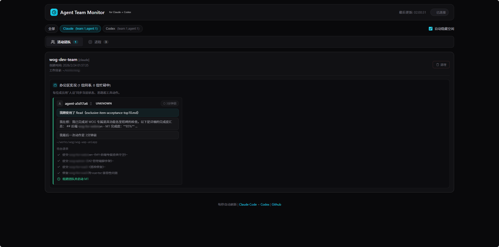
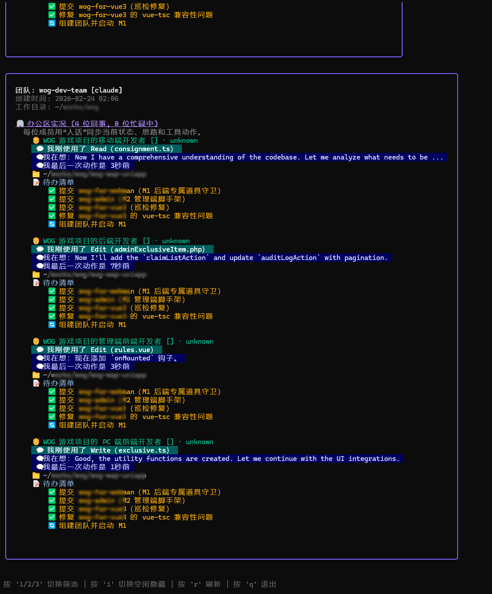

# Agent Team Monitor

[中文](#中文) | [English](#english)

---

<a id="中文"></a>

[Claude Code](https://docs.anthropic.com/en/docs/claude-code) + Codex 智能体团队实时监控面板。在终端或浏览器中追踪团队成员、任务状态、智能体思考过程、工具调用和进程信息。

## 截图

### Web 面板



### 终端界面 (TUI)



## 功能特性

- **团队总览** — 查看所有活跃的智能体团队、成员、角色和状态
- **任务追踪** — 任务按负责人分组展示，实时状态更新
- **智能体活动** — 实时显示思考过程 (💭)、工具调用 (🔧)、消息摘要 (📨)
- **进程监控** — 追踪运行中的 Claude Code / Codex 进程及运行时长
- **双模式** — 终端 UI 和 Web 面板布局一致
- **文件监听** — 基于 fsnotify 监听 `~/.claude/teams/`、`~/.claude/tasks/`、`~/.claude/projects/`、`~/.codex/sessions/`
- **自动刷新** — 两种模式均支持 1 秒智能更新

## 快速开始

```bash
git clone https://github.com/liaoweijun/agent-team-monitor.git
cd agent-team-monitor
make build
```

### TUI 模式（默认）

```bash
./bin/agent-team-monitor

# 仅监控 codex
./bin/agent-team-monitor -provider codex

# 同时监控 claude + codex
./bin/agent-team-monitor -provider both
```

| 按键           | 操作     |
| -------------- | -------- |
| `r`            | 手动刷新 |
| `q` / `Ctrl+C` | 退出     |

### Web 模式

```bash
./bin/agent-team-monitor -web

# 自定义端口
./bin/agent-team-monitor -web -addr :3000

# Web + 仅 codex
./bin/agent-team-monitor -web -provider codex
```

浏览器打开 `http://localhost:8080`。

- 默认暗色监控面板：`/`
- 办公场景游戏视图：`/game/`
- 也支持单地址切换：`/?view=game`、`/game/?view=dark`

### Linux 部署脚本

仓库内置了一个适合 Linux 服务器部署的管理脚本：

```bash
chmod +x ./scripts/service.sh

# 默认以 web 模式启动，端口 8080
./scripts/service.sh start

# 查看状态
./scripts/service.sh status

# 快速重启
./scripts/service.sh restart

# 停止
./scripts/service.sh stop

# 查看日志
./scripts/service.sh logs
```

也可以通过环境变量控制启动参数：

```bash
ATM_MODE=web ATM_PORT=3000 ATM_PROVIDER=both ./scripts/service.sh start
```

默认行为：

- PID 文件：`run/agent-team-monitor.pid`
- 标准日志：`logs/agent-team-monitor.out.log`
- 错误日志：`logs/agent-team-monitor.err.log`
- 启动前会自动执行 `go build`

## API 接口

```
GET /api/state      # 完整监控状态
GET /api/teams      # 团队信息
GET /api/processes  # 进程信息
GET /api/health     # 健康检查
```

```bash
curl http://localhost:3000/api/state | jq
```

## 环境变量

- `ATM_EXPOSE_ABS_PATHS` — 默认 `false`，设置为 `true/yes/on` 后，API 返回绝对路径（否则脱敏）
- `ATM_DISCOVERY_METRICS` — 默认 `false`，设置为 `true/yes/on` 后，输出 team 发现链路性能日志（耗时、缓存命中率、命中数）

## 工作原理

监控器监听 Claude Code 智能体的文件系统：

```
~/.claude/
├── teams/{team-name}/config.json       # 团队配置与成员
├── tasks/{team-name}/*.json            # 任务定义与状态
├── teams/{team-name}/inboxes/          # 智能体收件箱
├── projects/{project}/{session}.jsonl  # team lead 根会话日志
└── projects/{project}/{session}/subagents/agent-*.jsonl # 成员会话日志

~/.codex/
└── sessions/YYYY/MM/DD/rollout-*.jsonl # Codex 会话日志
```

## 项目结构

```
cmd/monitor/main.go              入口 & 模式选择
pkg/
├── types/types.go                共享数据结构
├── monitor/
│   ├── collector.go              数据聚合中心
│   ├── filesystem.go             fsnotify 文件监听
│   └── process.go                系统进程扫描
├── parser/
│   ├── team.go                   团队配置解析
│   ├── task.go                   任务文件解析
│   ├── inbox.go                  收件箱解析
│   └── activity.go               活动日志解析
├── api/
│   └── server.go                 HTTP 服务 & REST API
└── ui/
    └── tui.go                    终端 UI (Bubble Tea)
web/static/                       Web 前端 (HTML/CSS/JS)
```

## 跨平台构建

```bash
make build-all
```

输出 macOS (amd64/arm64) 和 Linux (amd64/arm64) 的二进制文件。

## 技术栈

- [Bubble Tea](https://github.com/charmbracelet/bubbletea) + [Lip Gloss](https://github.com/charmbracelet/lipgloss) — 终端 UI
- [fsnotify](https://github.com/fsnotify/fsnotify) — 文件系统监听
- [gopsutil](https://github.com/shirou/gopsutil) — 进程监控

## 常见问题

**未检测到团队** — 监控器会从 `~/.claude/teams/`、`~/.claude/tasks/`、`~/.claude/projects/` 和 `~/.codex/sessions/` 发现活动。若仍为空，请检查这些目录是否有最近数据。

**未检测到进程** — 确认 Claude Code 或 Codex 正在运行。监控器会扫描 `claude` / `codex` 相关进程。

**权限错误** — 确认对 `~/.claude/` 与 `~/.codex/` 目录有读取权限。

## 许可证

MIT

---

<a id="english"></a>

## English

Real-time monitoring dashboard for [Claude Code](https://docs.anthropic.com/en/docs/claude-code) + Codex agent teams. Track team members, tasks, agent thinking, tool usage, and processes — in your terminal or browser.

## Screenshots

### Web Dashboard


### Terminal UI (TUI)


## Features

- **Team Overview** — All active agent teams, members, roles, and status at a glance
- **Task Tracking** — Tasks grouped by assigned agent with real-time status
- **Agent Activity** — Live display of thinking (💭), tool usage (🔧), and messages (📨)
- **Process Monitoring** — Running Claude Code / Codex processes with uptime
- **Dual Mode** — Terminal UI and Web dashboard with consistent layout
- **File Watching** — fsnotify-based monitoring of `~/.claude/teams/`, `~/.claude/tasks/`, `~/.claude/projects/`, and `~/.codex/sessions/`
- **Auto Refresh** — 1-second smart updates in both modes

## Quick Start

```bash
git clone https://github.com/liaoweijun/agent-team-monitor.git
cd agent-team-monitor
make build
```

### TUI Mode (default)

```bash
./bin/agent-team-monitor

# Codex only
./bin/agent-team-monitor -provider codex

# Claude + Codex
./bin/agent-team-monitor -provider both
```

| Key            | Action         |
| -------------- | -------------- |
| `r`            | Manual refresh |
| `q` / `Ctrl+C` | Quit           |

### Web Mode

```bash
./bin/agent-team-monitor -web

# Custom port
./bin/agent-team-monitor -web -addr :3000

# Web + codex only
./bin/agent-team-monitor -web -provider codex
```

Open `http://localhost:8080` in your browser.

- Dark dashboard: `/`
- Office scene view: `/game/`
- Single-address switching: `/?view=game`, `/game/?view=dark`

## API Endpoints

```
GET /api/state      # Complete monitoring state
GET /api/teams      # Team information
GET /api/processes  # Process information
GET /api/health     # Health check
```

```bash
curl http://localhost:3000/api/state | jq
```

## Environment Variables

- `ATM_EXPOSE_ABS_PATHS` — default `false`; set `true/yes/on` to expose absolute paths in API output
- `ATM_DISCOVERY_METRICS` — default `false`; set `true/yes/on` to log discovery performance metrics (latency, cache hit rate, hit counts)

## How It Works

The monitor watches the Claude Code agent filesystem:

```
~/.claude/
├── teams/{team-name}/config.json       # Team config & members
├── tasks/{team-name}/*.json            # Task definitions & status
├── teams/{team-name}/inboxes/          # Agent inbox messages
├── projects/{project}/{session}.jsonl  # Team lead root session log
└── projects/{project}/{session}/subagents/agent-*.jsonl # Member session logs

~/.codex/
└── sessions/YYYY/MM/DD/rollout-*.jsonl # Codex session logs
```

## Architecture

```
cmd/monitor/main.go              Entry point & mode selection
pkg/
├── types/types.go                Shared data structures
├── monitor/
│   ├── collector.go              Central data aggregation
│   ├── filesystem.go             fsnotify file watcher
│   └── process.go                OS process scanner
├── parser/
│   ├── team.go                   Team config parser
│   ├── task.go                   Task file parser
│   ├── inbox.go                  Agent inbox parser
│   └── activity.go               Activity log parser
├── api/
│   └── server.go                 HTTP server & REST API
└── ui/
    └── tui.go                    Terminal UI (Bubble Tea)
web/static/                       Web dashboard (HTML/CSS/JS)
```

## Cross-Platform Build

```bash
make build-all
```

Outputs binaries for macOS (amd64/arm64) and Linux (amd64/arm64).

## Tech Stack

- [Bubble Tea](https://github.com/charmbracelet/bubbletea) + [Lip Gloss](https://github.com/charmbracelet/lipgloss) — Terminal UI
- [fsnotify](https://github.com/fsnotify/fsnotify) — Filesystem watching
- [gopsutil](https://github.com/shirou/gopsutil) — Process monitoring

## Troubleshooting

**No teams detected** — The monitor discovers activity from `~/.claude/teams/`, `~/.claude/tasks/`, `~/.claude/projects/`, and `~/.codex/sessions/`. If still empty, verify recent activity exists in those directories.

**No processes detected** — Make sure Claude Code or Codex is running. The monitor scans `claude` / `codex` related processes.

**Permission errors** — Ensure read access to both `~/.claude/` and `~/.codex/` directories.

## License

MIT
